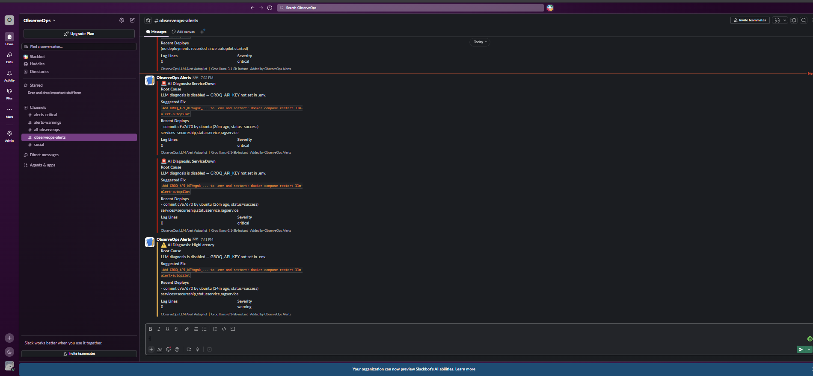

# ObserveOps

> Production systems fail. The average team spends **45 minutes** diagnosing before they start fixing.  
> ObserveOps cuts that to **~3 seconds** — AlertManager detects the failure, Loki pulls the last 50 log lines, an LLM finds the root cause, and Slack gets the fix command. No human involved.

[](https://github.com/RohanReddy-M/observeops/actions/workflows/deploy.yml)

Cloud platform built end-to-end on AWS — Terraform IaC, Kubernetes + ArgoCD GitOps, GitHub Actions CI/CD with OIDC, Prometheus + Grafana + Loki observability, LangGraph RAG agent, SLOs with error budgets, chaos engineering, and DORA metrics.

Live at **[secureship.click](https://secureship.click)** · [Run locally in 2 minutes](#running-locally) without an AWS account.

---

## See it in action

**AI autopilot: ServiceDown alert → LLM root cause → Slack in ~3 seconds**



**Grafana dashboards: SLO/Error Budget · DORA Metrics**


---

## By the numbers

| | |
|---|---|
| **~3 seconds** | alert fires → Slack diagnosis (AI autopilot) |
| **~30 seconds** | CloudTrail security event → Slack notification (Lambda) |
| **15 alert rules** | across 5 groups including LLM quality monitoring |
| **4 Grafana dashboards** | Services, SLO/Error Budget, DORA Metrics, LLM Ops |
| **8 ADRs** | every major design decision documented with tradeoffs |
| **3 services** | FastAPI + Flask + LangGraph RAG, all containerised |
| **2 EC2 instances** | app and observability separated by design |
| **1 Lambda** | CloudTrail security events → AI diagnosis → SNS |

---

## What makes this different from a standard monitoring project

- **LLM Alert Autopilot** — every alert is automatically diagnosed using real Loki logs + deployment history. Root cause and fix command posted to Slack in ~3 seconds, before a human opens their laptop
- **SLOs with 30-day error budgets** and burn rate alerting (14.4× multiplier from Google SRE Workbook — deploys block when budget burns too fast)
- **Chaos engineering that catches zombie recovery** — after an OOM kill the service restarts and the health check passes, but the in-memory FAISS index is empty and all queries return nothing. Basic uptime monitoring misses this. Caught by checking `vector_store_documents_total` after recovery
- **DORA metrics tracked automatically** — deployment frequency, MTTR from resolved alerts, AI diagnosis success rate
- **Deadman switch** — Watchdog alert proves the alerting pipeline itself is alive, not just the services it monitors
- **8 Architecture Decision Records** documenting every major design choice with alternatives considered and rejected

---

## Architecture

```
Internet
    │
    ▼
Route53 (secureship.click) ── A alias record → ALB
    │
    ▼
ALB  (public subnet)
    │  port 80  → redirect to 443
    │  port 443 → forward (ACM certificate, TLS terminated here)
    │
    │  /api/*      → secureship    :8001  (FastAPI + DynamoDB)
    │  /status/*   → statusservice :8002  (Flask, failure simulation)
    │  /ai/*       → ragservice    :8003  (LangGraph RAG agent)
    │  /grafana/*  → obs server    :3000
    │
    ▼  private subnets (no public IPs — only ALB can reach these)
    │
    ├── EC2: App Server
    │       nginx                 reverse proxy, rate limiting, JSON access logs
    │       secureship            FastAPI, DynamoDB-backed ships API, rate limiting
    │       statusservice         Flask, /load and /fail endpoints for drill testing
    │       ragservice            LangGraph + FAISS + Groq, anti-hallucination RAG
    │       llm-alert-autopilot   AlertManager webhook receiver → LLM diagnosis → Slack
    │       otel-collector        receives traces from apps, forwards to Tempo
    │       promtail              ships container logs to Loki
    │
    └── EC2: Observability Server  (separate host — by design)
            prometheus      scrapes all services every 15s, evaluates SLO recording rules
            grafana         4 dashboards: services, SLO/error budget, DORA, LLM ops
            loki            log aggregation
            alertmanager    routes alerts → llm-autopilot → Slack (critical/warning)
            grafana-tempo   distributed trace storage
            node-exporter   host-level metrics (CPU, memory, disk, network)

Alert pipeline:
    Prometheus threshold breached
        → AlertManager fires
            → llm-alert-autopilot (Loki log query + deploy context + Groq LLM)
                → Slack diagnosis in ~3 seconds (root cause + fix command)
            → also POST to Lambda Function URL (deeper incident analysis)
                → Lambda calls RAGService → diagnosis published to SNS

    Watchdog alert (always fires every 15s)
        → watchdog-sink receiver (deadman switch)
            → healthchecks.io ping — if pings stop, alerting pipeline is dead
                        → email / Slack / PagerDuty subscribers
```

**Why two EC2 instances?** When a service has a problem — high CPU, memory leak, disk full — that's exactly when you need monitoring to work. If Prometheus and Grafana share a host with the app, the CPU spike you're trying to diagnose is also degrading your ability to diagnose it. Separate hosts eliminate that coupling.

---

## AI Layer

### RAGService — LangGraph RAG agent with hallucination fallback

Standard RAG: embed a query, retrieve similar documents, pass to LLM. The problem is that LLMs generate confidently even when retrieved documents are irrelevant — which is worse than saying "I don't know."

The solution is a grading node in the LangGraph pipeline that measures cosine similarity between the query vector and retrieved document vectors before passing to the LLM:

```
query → retrieve (FAISS, top-4) → grade relevance
                                        │
                        cosine_sim > threshold → generate (LLM answers)
                        cosine_sim ≤ threshold → no_context (honest refusal)
```

FAISS returns squared L2 distance. For unit-norm vectors: `d² = 2*(1 - cosine_sim)`. Threshold of `d² < 1.5` maps to `cosine_sim > 0.25` — meaningfully related. Off-topic queries get: *"I don't have enough context — use POST /ingest to add relevant runbooks."*

**LLM:** Groq `llama-3.1-8b-instant` — ~200 tokens/sec, free tier, provider-agnostic wrapper so swapping to GPT-4 or Gemini is one line.

**Embeddings:** `all-MiniLM-L6-v2` — 80 MB, CPU-only, cached in the Docker image layer so container starts instantly even without a GPU.

### Lambda Incident Analyzer

AlertManager sends a webhook to a Lambda Function URL on every firing alert. Lambda calls RAGService with the alert context and publishes the diagnosis to SNS. Runs on a 5-minute EventBridge schedule for proactive health checks too.

**Why Lambda Function URL instead of API Gateway?** API Gateway adds cost, latency, and configuration overhead for a single webhook endpoint. Function URLs give you a direct HTTPS endpoint for Lambda at zero cost and zero operational overhead.

**Security:** Every webhook is validated using HMAC shared secret with `hmac.compare_digest` (constant-time comparison, prevents timing attacks). The secret is generated by Terraform, stored in SSM as a SecureString, and injected via environment variable — never in code or git history.

---

## Observability

**15 alert rules** across 5 groups — not just infrastructure, but AI quality:

| Group | Examples |
|---|---|
| Service availability | `ServiceDown`, `ContainerRestartingFrequently` |
| Error rates | `HighErrorRate` (>5%), `CriticalErrorRate` (>25%) |
| Latency | `HighLatency` (p99 > 2s) |
| Infrastructure | `HighCPUUsage`, `HighMemoryUsage`, `DiskSpaceLow`, `DiskSpaceCritical` |
| LLM quality | `LLMHighErrorRate`, `LLMHighLatency`, `RAGHighUngroundedRate`, `RAGServiceDown`, `LokiDown` |

`RAGHighUngroundedRate` is a model quality alert — if more than 50% of answers are not grounded in retrieved context, the knowledge base is too sparse and needs more documents ingested. This is LLMOps monitoring, not just infrastructure monitoring.

**5 custom Prometheus metrics** in RAGService (`llmops.py`):
- `llm_request_duration_seconds` — histogram by model and operation
- `llm_requests_total` — counter by model and status
- `rag_queries_total` — counter by grounded/ungrounded
- `rag_documents_retrieved` — histogram of retrieval count per query
- `vector_store_documents_total` — gauge showing knowledge base size

**RAG quality evaluation harness** (`apps/ragservice/eval.py`) — 5 test cases with keyword scoring. Exits non-zero on quality regression. Runs as a CI gate on every push so prompt changes or document updates that break answer quality are caught before production.

---

## Infrastructure (`terraform/`)

Everything is Terraform. `make infra-up` brings up the full stack from scratch. `make infra-down` destroys expensive resources (EC2, ALB, NAT Gateway) and stops billing — Route53 zone is kept to avoid DNS propagation issues on rebuild.

```
modules/
├── vpc/        VPC, public/private subnets, IGW, NAT Gateway, route tables
├── security/   security groups (ALB → EC2 only, admin SSH by IP)
├── compute/    EC2 instances, IAM roles, SSM Parameter Store access
├── alb/        ALB, ACM certificate, DNS validation records, Route53 A record
├── dynamodb/   ships table, PAY_PER_REQUEST, point-in-time recovery
└── lambda/     incident analyzer, Function URL, SQS DLQ, EventBridge rule, SNS
```

Key security decisions:
- **IMDSv2 enforced** on all EC2 — blocks SSRF attacks that steal IAM credentials via the metadata endpoint
- **Private subnets** — EC2 has no public IP, unreachable directly from the internet
- **Least-privilege IAM** — EC2 role can only read its own SSM parameters and its own DynamoDB table
- **SQS Dead Letter Queue** on Lambda — failed alert processing is never silently dropped
- **`reserved_concurrent_executions` removed** — new AWS accounts have a concurrency limit of 10; DLQ handles retry instead

---

## CI/CD (`.github/workflows/deploy.yml`)

```
push → main/develop
    │
    ├── test          pytest (SecureShip + StatusService + RAGService) + Docker build smoke test
    │                 RAG quality eval harness
    │
    ├── security-scan  Trivy: CVE scan on all files
    │   (parallel)     Bandit: Python SAST (injection, hardcoded secrets, insecure functions)
    │                  TruffleHog: git history scan for accidentally committed secrets
    │
    ├── terraform-lint terraform fmt -recursive + tfsec static analysis
    │   (parallel)     accepted deviations documented in .tfsec/config.yml
    │
    ├── check-aws      gates build+deploy on whether infra is running
    │                  (checks EC2_INSTANCE_ID + AWS_ROLE_ARN + ECR_REGISTRY secrets)
    │
    ├── build-push     builds 3 images, pushes to ECR with git SHA tag
    │                  cache-from: latest to keep build times fast
    │
    ├── update-k8s     commits new image tags into kubernetes/apps/ manifests
    │                  ArgoCD detects the diff and syncs the cluster
    │
    └── deploy         SSM Run Command → deploy.sh on EC2
                       rolling deploy (secureship → statusservice → ragservice)
                       smoke tests 7 endpoints
                       auto-rollback to previous image if any smoke test fails
```

**Why SSM instead of SSH?** EC2 is in a private subnet with no inbound port 22 open. SSM Session Manager reaches the instance through the AWS control plane — no VPN, no bastion host, no open ports. The attack surface is smaller and there are no SSH keys to rotate or lose.

**Why OIDC instead of stored AWS keys?** GitHub Actions OIDC issues a short-lived STS token (1 hour) per run. Static keys are permanent until manually rotated — if leaked, they're valid indefinitely. OIDC tokens expire automatically.

---

## Security model

| Layer | What it does |
|---|---|
| Route53 | DNS only — no compute exposure |
| ACM | TLS terminated at ALB — EC2 never handles raw TLS |
| ALB security group | Inbound 80/443 from `0.0.0.0/0` only — nothing else |
| EC2 security group | Inbound from ALB security group only — no direct internet access |
| IMDSv2 | Requires session token — blocks SSRF credential theft |
| IAM role | Least privilege — scoped to `/observeops/*` SSM params and `observeops-*` DynamoDB tables |
| SSM Parameter Store | Secrets encrypted at rest with KMS — never in code, git, or user data |
| Webhook HMAC | `hmac.compare_digest` constant-time comparison — prevents timing attacks |
| Non-root containers | All containers run as `appuser` (UID 1001) — exploit gets no sudo |
| Trivy + Bandit + TruffleHog | CVE scanning, SAST, and secret scanning on every push |

---

## Reliability Engineering

### Service Level Objectives

Four SLOs defined and tracked in Grafana with 30-day error budgets:

| Service | SLO | Error Budget | Alert |
|---|---|---|---|
| SecureShip availability | 99.5% | 216 min/month | `SecureShipSLOBreach` |
| SecureShip p99 latency | < 500ms | — | `HighLatency` |
| RAGService success rate | 95% | — | `RAGServiceSuccessSLOBreach` |
| RAGService grounded rate | 50% | — | `RAGHighUngroundedRate` |

**Error budget burn rate alerting:** `SecureShipBurnRateTooHigh` fires when the 1-hour burn rate exceeds 14.4× the allowed pace — meaning the monthly budget will be exhausted in ~50 hours. At this threshold, deploys are blocked until reliability recovers. The 14.4 multiplier comes from Google's SRE Workbook multi-window burn rate model.

`RAGIndexEmpty` fires when RAGService is running but the FAISS knowledge base has zero documents — a "zombie recovery" state discovered during chaos experiments where the service appeared healthy but answered nothing.

### Chaos Engineering

```bash
make chaos          # kill secureship → verify alert fires + API recovery
make chaos-oom      # simulate memory exhaustion on ragservice
make chaos-depkill  # kill loki → test graceful degradation
```

Each run:
1. Injects the failure
2. Verifies `ServiceDown` alert fires in AlertManager (target: <90 seconds)
3. Verifies container auto-restarts (restart: unless-stopped)
4. **End-to-end functional verification** — not just "container is running" but actual API call + FAISS document count check
5. Auto-generates a postmortem pre-fill in `docs/postmortems/`

**The zombie recovery problem:** After an OOM kill, the container restarts and the health check passes — but the in-memory FAISS index is empty. All queries return "I don't have enough context." Basic uptime monitoring misses this entirely. The chaos script catches it by checking `vector_store_documents_total` after recovery. A completed postmortem from this discovery is in `docs/postmortems/2026-05-31-chaos-ragservice-oom.md`.

### DORA Metrics

`deploy.sh` registers every deployment with the LLM Alert Autopilot via `POST /deploy-event`. AlertManager resolved-alerts provide MTTR. Grafana DORA dashboard shows:

- **Deployment frequency** — deploys per 7/30 days
- **MTTR** — p50 and p95 recovery time from Prometheus histogram
- **AI diagnosis success rate** — fraction of alerts successfully diagnosed by LLM

When an alert fires, the LLM diagnosis includes: *"High error rate started 8 minutes after commit `abc1234` deployed by Rohan"* — deploy context is automatically included so root cause correlation is immediate.

### Architecture Decision Records

Eight ADRs in `docs/adr/` document the reasoning behind every major design decision:

| ADR | Decision |
|---|---|
| 001 | Two-server architecture (app vs observability) |
| 002 | SSM Session Manager instead of SSH |
| 003 | DynamoDB instead of RDS |
| 004 | OIDC instead of IAM access keys for CI/CD |
| 005 | RAG with grounding check instead of raw LLM |
| 006 | Prometheus + Grafana instead of Datadog/New Relic |
| 007 | Deadman switch (Watchdog alert pattern) |
| 008 | Container image pinning strategy and supply chain tradeoffs |

---

## Running locally

```bash
cp .env.example .env   # add GROQ_API_KEY (free at console.groq.com)
make dev-up            # starts all services in correct order

# Services
# SecureShip:          http://localhost:8001/docs
# StatusService:       http://localhost:8002
# RAGService:          http://localhost:8003/docs
# LLM Alert Autopilot: http://localhost:8080/health
# Grafana:             http://localhost:3000  →  admin / observeops123
# Prometheus:          http://localhost:9090
# AlertManager:        http://localhost:9093
#
# Dashboards:
#   Services Overview:  http://localhost:3000/d/observeops-services
#   SLO + Error Budget: http://localhost:3000/d/observeops-slo
#   DORA Metrics:       http://localhost:3000/d/observeops-dora
#   LLM Ops:            http://localhost:3000/d/observeops-llm

# Ingest a runbook into RAGService
curl -X POST http://localhost:8003/ingest \
  -H "Content-Type: application/json" \
  -d '{"texts": ["When CPU is high, run: top -b -n1 | head -20 to identify the process. Then: docker stats to see container usage."]}'

# Query the RAG agent
curl -X POST http://localhost:8003/ai/query \
  -H "Content-Type: application/json" \
  -d '{"question": "CPU is spiking on the app server, what do I do?"}'

# Trigger a failure drill
curl -X POST "http://localhost:8002/fail?error_rate=0.5"

# Run tests
pytest apps/secureship/tests/ -v
pytest apps/ragservice/tests/ -v
python apps/ragservice/eval.py   # RAG quality score
```

SecureShip falls back to in-memory data when `DYNAMODB_TABLE` is not set — no AWS account needed for local development.

---

## AWS deployment

```bash
# Prerequisites: AWS CLI configured, Terraform installed, SSH key at ~/.ssh/id_rsa.pub
# Set your IP: MY_IP=$(curl -s ifconfig.me)
# terraform/terraform.tfvars → admin_cidr = "$MY_IP/32"

make infra-up    # ~10 minutes: Terraform + EC2 bootstrap + CI/CD deploy
make infra-down  # stops billing (keeps Route53 zone — ~₹42/month idle)
```

**Cost when idle:** Route53 hosted zone ~$0.50/month. Everything else is zero — EC2, ALB, NAT Gateway, Lambda, DynamoDB all stopped or pay-per-request.

**Cost when running:** Two `t3.small` EC2 (~$30/month), one NAT Gateway (~$35/month), ALB (~$20/month). Spin up for demos, tear down after.

---

## Cost (FinOps)

Infrastructure is torn down when not in use. When running, the full stack costs:

| Resource | Type | Cost/month |
|---|---|---|
| EC2 App Server | t3.small | ~$15 |
| EC2 Observability Server | t3.small | ~$15 |
| ALB | per LCU | ~$20 |
| NAT Gateway | per GB | ~$35 |
| DynamoDB | on-demand | ~$1 |
| Route53 | hosted zone | ~$0.50 |
| ECR | image storage | ~$1 |
| Lambda | free tier | ~$0 |
| **Total** | | **~$87/month** |

Cost optimisation decisions made:
- **t3.small over t3.medium** — sufficient for demo traffic, saves $30/month
- **On-demand DynamoDB over provisioned** — traffic is too unpredictable to reserve capacity cost-effectively at this scale
- **Infra torn down when idle** — NAT Gateway is the dominant cost driver; destroying it when not needed saves ~$35/month
- **Spot instances in K8s manifests** — EKS node group uses spot for 60-70% cost reduction

---

## Note on live demo

**secureship.click is live on-demand.** AWS infrastructure (EC2, ALB, NAT Gateway) is torn down when not in use to avoid ~$87/month in idle costs. Run `make infra-up` to provision from scratch in ~10 minutes, or run `make dev-up` locally — no AWS account required (DynamoDB falls back to in-memory, Groq API key is the only requirement).

To request a live demo: open an issue on this repo or reach out directly.
